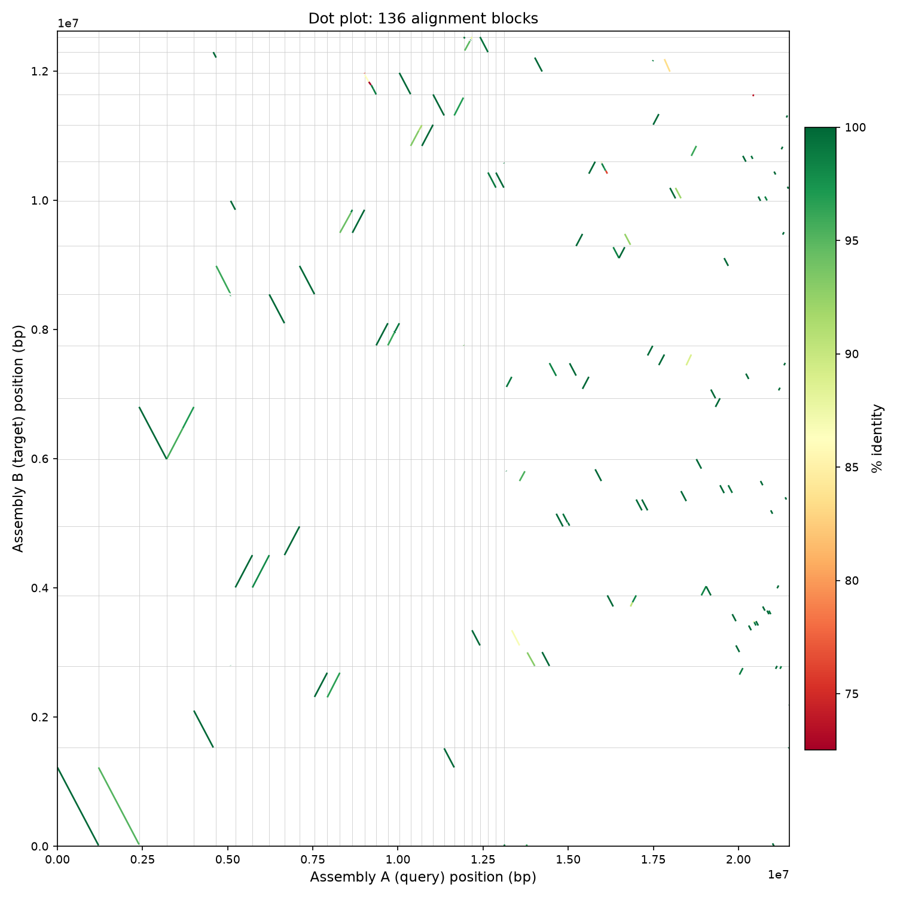
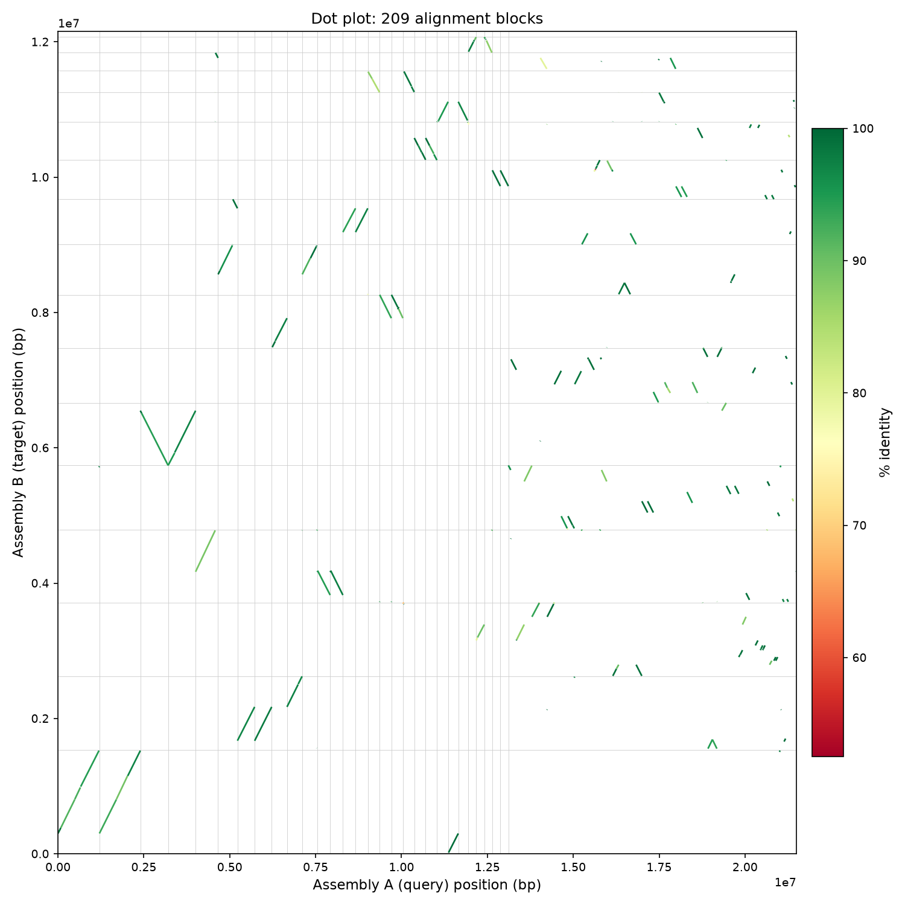
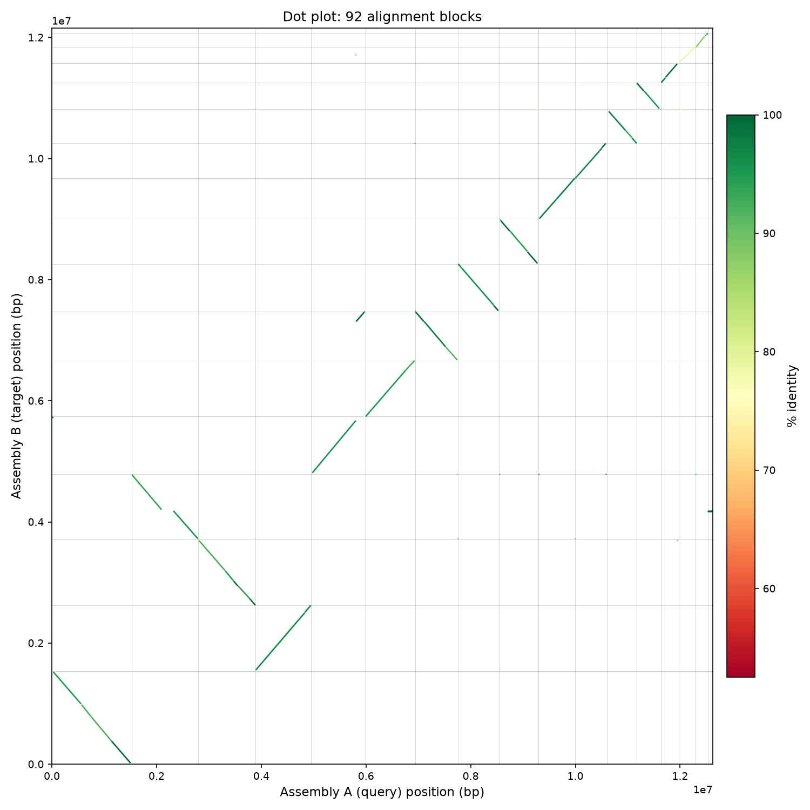

# Use Case 01 — Is the HiFiasm assembly "really duplicated"? Comparing HiFiasm and Flye assemblies of a hybrid yeast strain

**Goal:** Use `YithCOMPASM compare_assemblies` to explain a striking BUSCO
discrepancy observed between two PacBio HiFi assemblies of the same sample —
built with HiFiasm and Flye — and determine whether it reflects a technical
assembly artifact or genuine biology.

This example originates from the *Escuela de Verano BCB 2026* genome
assembly practical (Exercise 5–6, `P01_AssemblyPractice.pdf`). The class QC
table (BUSCO, Merqury) flags a large duplication discrepancy between the two
assemblers and explicitly asks: *"Is the HIFIASM really duplicated? Is a
technical problem or do it have a biological reason?"* — this use case
answers that question with base-pair-resolved, whole-genome evidence rather
than gene-sampling metrics alone.

---

## Overview

| Item | Detail |
|---|---|
| Sample | SPSC01 — an industrial hybrid yeast strain created by protoplast fusion of *Saccharomyces cerevisiae* and *Schizosaccharomyces pombe* |
| BioProject | [PRJNA1075684](https://www.ncbi.nlm.nih.gov/bioproject/1075684) — "*Saccharomyces cerevisiae* SPSC01 Genome sequencing and assembly" |
| SRA run | SRR27947616 (PacBio HiFi) |
| Read filtering | Chopper, Q20, minimum length 30 kb |
| Assemblers compared | HiFiasm (primary contigs) vs. Flye |
| SPSC01 published assembly | GCA_047651925.1 (17 chromosomes) |
| Parental references used (Step 6) | *S. cerevisiae* S288C (GCF_000146045.2), *S. pombe* 972h⁻ (GCF_000002945.2) |

---

## Background — why this sample is a good stress test

SPSC01 is not a simple diploid strain: it is a laboratory-made **interspecies
fusant** combining an industrial *S. cerevisiae* strain with *S. pombe*,
selected for improved flocculation and stress tolerance. This matters for
interpreting assembly output — *S. cerevisiae* and *S. pombe* are only
distantly related (different genera), so any duplication signal here is
*not* explained by the usual "two haplotypes of one diploid genome" story
in the same simple way it would be for an intraspecific cross. Whatever the
assemblies disagree about needs to be checked directly rather than assumed.

---

## Step 1 — Data source

PacBio HiFi reads for SPSC01 were downloaded from SRA run **SRR27947616**,
associated with BioProject
[PRJNA1075684](https://www.ncbi.nlm.nih.gov/bioproject/1075684).

---

## Step 2 — Read filtering with Chopper

Raw HiFi reads were filtered with Chopper (quality ≥ Q20, minimum length
30 kb) before assembly:

```bash
chopper -t 3 --quality 20 --minlength 30000 \
    --input SRR27947616_PBHiFi_SPSC01.fastq \
    > SRR27947616_PBHiFi_SPSC01.fQ20l30k.fastq
```

---

## Step 3 — Assembly

Both assemblers were run on the same filtered HiFi read set.

### HiFiasm

```bash
hifiasm -t 3 -o SacerSPSC01HIFIASM01 \
    SRR27947616_PBHiFi_SPSC01.fQ20l30k.fastq

# primary-contig GFA converted to FASTA with GenoToolBoxPlus
python3 scripts/GFA2FASTA.py \
    --input   SacerSPSC01HIFIASM01.bp.p_ctg.gfa \
    --output  SacerSPSC01HIFIASM01.bp.p_ctg.fasta \
    --summary SacerSPSC01HIFIASM01.bp.p_ctg.summary.txt
```

### Flye

```bash
flye --genome-size 12m --threads 3 \
    --out-dir SacerFLYE01_HIFI \
    --pacbio-hifi SRR27947616_PBHiFi_SPSC01.fQ20l30k.fastq
```

Note the `--genome-size 12m` estimate — sized for a single *S. cerevisiae*-like
haploid genome, not the ~24.7 Mb a full *S. cerevisiae* + *S. pombe* fusant
would need if both parental genomes were present intact. This mainly affects
Flye's internal coverage heuristics rather than acting as a hard cap, but is
worth keeping in mind given the results below.

### Basic assembly metrics (QUAST, from the class practical)

| Metric | Flye | HiFiasm |
|---|---|---|
| Total assembly size (Mb) | 21.49 | 12.62 |
| Total contigs (N) | 99 | 17 |
| Longest contig (Mb) | 1.21 | 1.53 |
| N90 (Mb) | 0.13 | 0.94 |
| L90 (N) | 65 | 13 |

---

## Step 4 — The BUSCO discrepancy that motivates this use case

BUSCO (`saccharomycetes_odb10`, 2137 orthologs) was run on both assemblies
as part of the class QC exercise. The exact output (`short_summary.*.txt`)
shows:

| Metric | Flye | HiFiasm |
|---|---|---|
| Complete BUSCOs (C) | 99.2% | 98.7% |
| **Single-copy (S)** | **28.9%** (618 genes) | **95.6%** (2044 genes) |
| **Duplicated (D)** | **70.3%** (1502 genes) | **3.0%** (65 genes) |
| Fragmented (F) | 0.2% | 0.0% |
| Missing (M) | 0.6% | 1.3% |

This is the crux of the class's Question 3. 70% of near-universal
single-copy orthologs appear in duplicate in the Flye assembly — a huge
signal — but BUSCO only samples ~2,137 loci and can't say *where* in the
genome this is happening, *how much* sequence is affected in total, or
whether it's isolated to specific regions/contigs. A same-assembly
duplication scan (e.g. Mash-based, as used in `YuggASMoth`) also doesn't
resolve this, because it only flags redundant sequence *within* a single
assembly — and neither assembly is internally self-redundant here (each
one is an internally consistent representation; running YuggASMoth's
duplication check on the HiFiasm assembly alone reports none, which is
expected and not actually informative about this question). Answering the
class's question needs a direct, base-pair-resolved comparison *between*
the two assemblies — which is exactly what `YithCOMPASM compare_assemblies`
does.

---

## Step 5 — Compare the assemblies with YithCOMPASM

```bash
python3 scripts/YithCOMPASM.py compare_assemblies \
    --assembly_a Sacer_HIFI_FLYE.fasta \
    --assembly_b Sacer_HIFI_HIFIASM.fasta \
    --output     results/SPSC01_flye_vs_hifiasm \
    --preset     asm20 \
    --threads    4
```

`asm20` was used instead of the default `asm5` because the divergence
between the two parental subgenomes of an interspecies fusant is expected
to exceed the ~5% `asm5` is tuned for.

---

## Results

| Metric | Value |
|---|---|
| Alignment blocks kept | 136 |
| Coverage of Flye (query) | 99.28% |
| Coverage of HiFiasm (target) | 97.23% |
| Length-weighted identity | 97.98% (range 72.5–100%) |
| **Redundant bp in HiFiasm** | **9,124,531 bp** |
| **Multiplicity in HiFiasm** | **1.74x** |
| Redundant regions (depth ≥2) in HiFiasm | 132 (48 of which are depth ≥3) |
| Rearrangement/inversion candidates | 3 |

The `multiplicity_b = 1.74x` figure lines up almost exactly with the raw
assembly-size ratio (21.49 Mb / 12.62 Mb ≈ 1.70) — independent, whole-genome
confirmation of the same signal BUSCO's gene sampling picked up, but now
quantified in base pairs and localized to 132 explicit regions
(`examples/SPSC01_HiFiasm_vs_Flye/redundancy_HIFIASM.tsv`) instead of an
aggregate percentage over ~2,100 genes.

The correspondence table (`mod05_correspondence_*.tsv`) shows the same
pattern from a different angle: every one of HiFiasm's 17 contigs is the
best match for somewhere between 2 and 14 different Flye contigs — the
signature of many query sequences collapsing onto one target, consistent
with Flye resolving two divergent copies of most loci that HiFiasm's
primary-contig output merges into one.

### Dot plot



Flye (query, x-axis) vs. HiFiasm (target, y-axis), alignment blocks colored
by percent identity. The repeated near-parallel diagonal bands — multiple
Flye contigs tracking the same y-range on a single HiFiasm contig — are the
visual signature of the redundancy quantified above.

---

## Step 6 — Resolving the origin of the redundancy: comparison against both parental references

The comparison above establishes *that* HiFiasm's assembly is redundant
relative to Flye's, but not *which* parental subgenome (*S. cerevisiae* or
*S. pombe*) the retained sequence belongs to, or whether the "hybrid"
nature of SPSC01 is actually reflected in the sequenced genome content.
Both assemblies were compared against both parental reference genomes:

```bash
# S. cerevisiae reference: GCF_000146045.2 (S288C)
# S. pombe reference:      GCF_000002945.2 (972h-)

python3 scripts/YithCOMPASM.py compare_assemblies \
    --assembly_a Sacer_HIFI_FLYE.fasta \
    --assembly_b GCF_000146045.2_R64_genomic.fna \
    --output results/flye_vs_scer --preset asm20 --threads 4

python3 scripts/YithCOMPASM.py compare_assemblies \
    --assembly_a Sacer_HIFI_FLYE.fasta \
    --assembly_b GCF_000002945.2_ASM294v3_genomic.fna \
    --output results/flye_vs_spombe --preset asm20 --threads 4

python3 scripts/YithCOMPASM.py compare_assemblies \
    --assembly_a Sacer_HIFI_HIFIASM.fasta \
    --assembly_b GCF_000146045.2_R64_genomic.fna \
    --output results/hifiasm_vs_scer --preset asm20 --threads 4

python3 scripts/YithCOMPASM.py compare_assemblies \
    --assembly_a Sacer_HIFI_HIFIASM.fasta \
    --assembly_b GCF_000002945.2_ASM294v3_genomic.fna \
    --output results/hifiasm_vs_spombe --preset asm20 --threads 4
```

### Results

| Comparison | Coverage of assembly | Coverage of reference | Multiplicity |
|---|---|---|---|
| Flye vs. *S. cerevisiae* (S288C) | **98.38%** | 97.98% | **1.79x** |
| Flye vs. *S. pombe* (972h⁻) | 0.18% | 0.10% | — |
| HiFiasm vs. *S. cerevisiae* (S288C) | **96.23%** | 96.73% | **1.04x** |
| HiFiasm vs. *S. pombe* (972h⁻) | 1.45% | 0.08% | — |

This is decisive. Essentially the entire Flye assembly (98%) and HiFiasm
assembly (96%) is *S. cerevisiae* sequence; almost nothing aligns to
*S. pombe* (the handful of hits are a few kb at most, most plausibly
conserved rRNA/tRNA loci rather than real synteny). The internal
consistency check confirms it numerically, not just qualitatively: the
*S. cerevisiae* reference is 12.16 Mb; 12.16 × 1.79 ≈ 21.77 Mb (Flye's real
total is 21.49 Mb), and 12.16 × 1.04 ≈ 12.65 Mb (HiFiasm's real total is
12.62 Mb) — both match almost exactly.




---

## Discussion — answering the class's Question 3

**"Is the HIFIASM really duplicated? Is a technical problem or do it have a
biological reason?"**

The `YithCOMPASM` result supports a biological explanation over a technical
error, with one important caveat worth investigating further:

1. **The redundancy is real, large, and structured, not noise.** 9.12 Mb —
   nearly three-quarters of the HiFiasm assembly's own 12.62 Mb length — is
   covered ≥2x by Flye sequence, concentrated in 132 discrete regions rather
   than being smeared thinly and randomly across the genome. A technical
   assembly bug would be far less likely to produce this consistent,
   genome-scale, roughly-2x pattern.

2. **This is consistent with expected assembler behavior, not a bug in
   either tool.** HiFiasm's primary-contig output (`bp.p_ctg`, what
   `GFA2FASTA.py` converted here) is designed to collapse heterozygous
   variation into one representative haploid mosaic per locus by default —
   it is not attempting haplotype-resolved output unless run with
   additional phasing information (trio binning, Hi-C). Flye, run here
   without any haplotype-collapsing step, is retaining both divergent
   copies as separate contigs. Seen this way, "HiFiasm is duplicated" is
   the wrong framing — rather, **Flye is retaining real biological
   variation that HiFiasm's primary assembly mode is designed to discard.**
   This directly matches why a same-assembly duplication scan (YuggASMoth)
   reports nothing wrong with the HiFiasm assembly on its own: there
   genuinely isn't redundant sequence *within* it — the "duplication" only
   becomes visible when compared against an assembly that made a different
   representational choice.

3. **The redundancy is *S. cerevisiae* haplotype duplication, not retained
   *S. pombe* content — and the "hybrid" genome isn't really in these
   assemblies at all.** Step 6 resolves what was initially left as an open
   question: both assemblies are >96% *S. cerevisiae* sequence, and
   *S. pombe* is essentially absent (<2% coverage, driven by a handful of
   short conserved loci rather than real synteny). So the redundancy isn't
   "Flye kept both parental subgenomes separate, HiFiasm merged them" — it
   is specifically **two divergent haplotype copies of the *S. cerevisiae*
   subgenome**, retained separately by Flye (1.79x vs. the pure
   *S. cerevisiae* reference) and collapsed to essentially one copy by
   HiFiasm (1.04x). The *S. pombe* side of this engineered fusant strain is
   not represented in the HiFi sequencing data used for either assembly —
   consistent with the well-documented genomic instability of protoplast
   fusants, where one parental genome is frequently lost over generations
   of industrial strain propagation and selection. Confirming *why* it was
   lost (loss during fusant construction vs. loss during subsequent culture,
   vs. simply not present in the DNA extraction used for this sequencing
   run) would need information outside the scope of what these two
   assemblies alone can answer.

**Practical takeaway for the class exercise:** don't discard or "fix" the
HiFiasm duplication as an error — it's the expected behavior of a
primary/collapsed assembly mode applied to a genuinely heterozygous
diploid *S. cerevisiae* subgenome. If a haplotype-resolved assembly is the
actual goal, that requires rerunning HiFiasm with phasing data (trio,
Hi-C) rather than treating this primary-contig output as final, or working
from the Flye assembly directly with the understanding that it is *not*
single-copy per locus. Separately, if recovering the *S. pombe* half of
this strain's genome is actually the goal, that is a sample/sequencing
question (is *S. pombe* DNA present in the culture at all?), not an
assembly-parameter question — no amount of reassembly of this particular
read set will recover subgenome content that isn't in the reads.

---

## Reproducing this example

All commands above use the exact assembly files and parameters run for
this example. Reference genomes: *S. cerevisiae* S288C
([GCF_000146045.2](https://www.ncbi.nlm.nih.gov/datasets/genome/GCF_000146045.2/))
and *S. pombe* 972h⁻
([GCF_000002945.2](https://www.ncbi.nlm.nih.gov/datasets/genome/GCF_000002945.2/)),
both fetched via the NCBI Datasets API. Output files are committed under
[`examples/SPSC01_HiFiasm_vs_Flye/`](examples/SPSC01_HiFiasm_vs_Flye/):
dot plots and the SPSC01-pair summary/redundancy/rearrangement files at
the top level, and the four reference-comparison alignment summaries under
`reference_comparisons/` — enough to check every number in this document
without rerunning anything.
